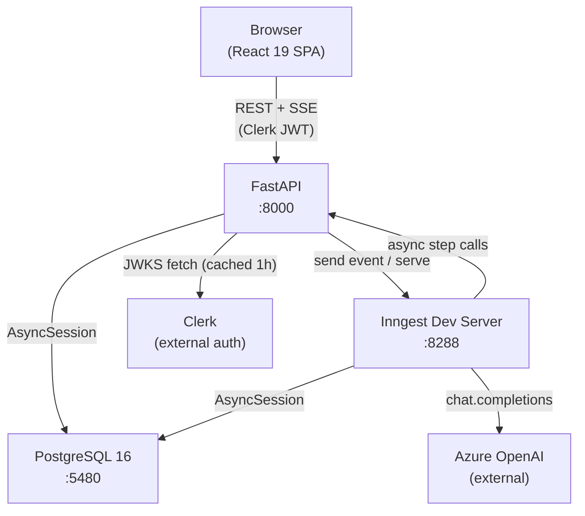
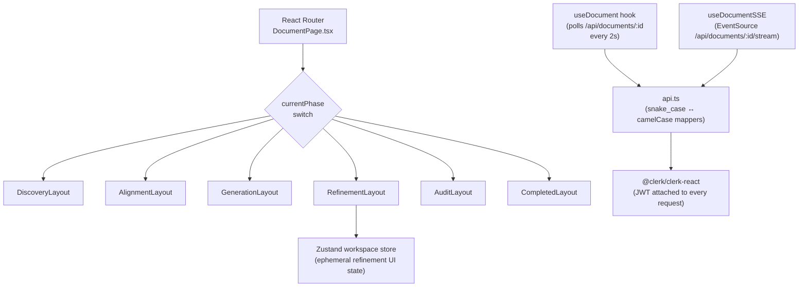
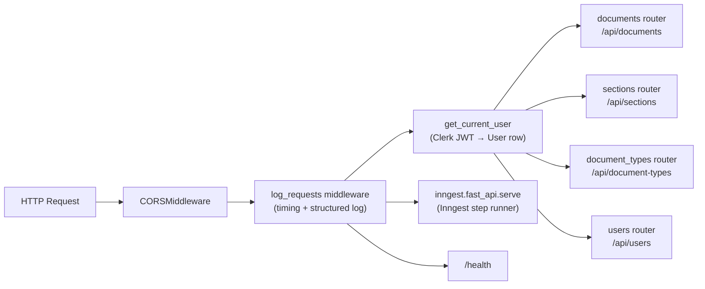
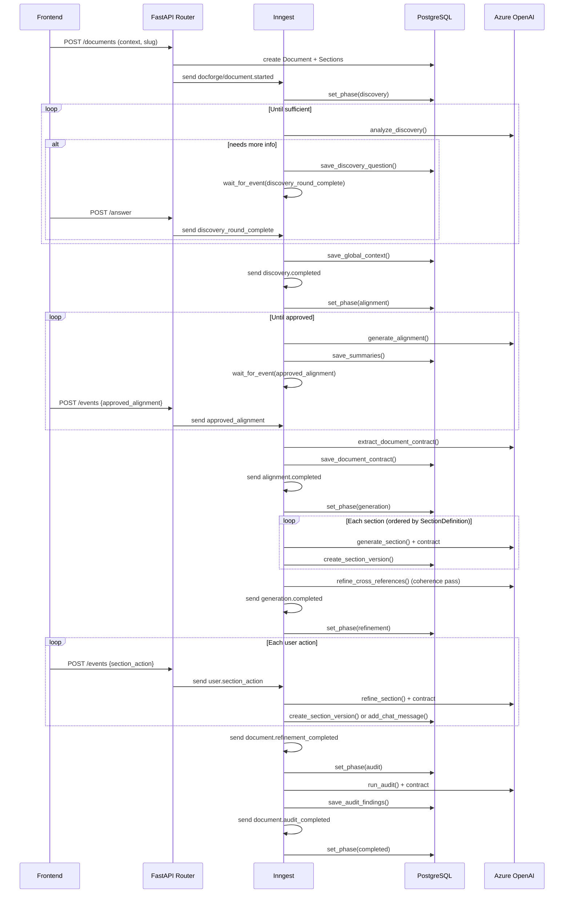
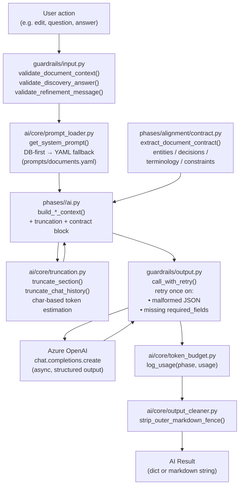
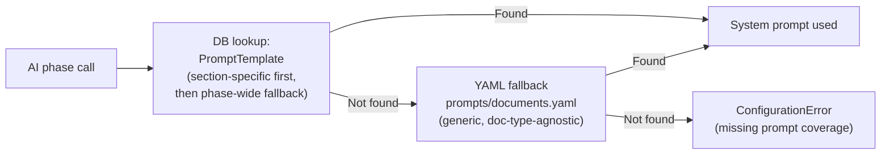
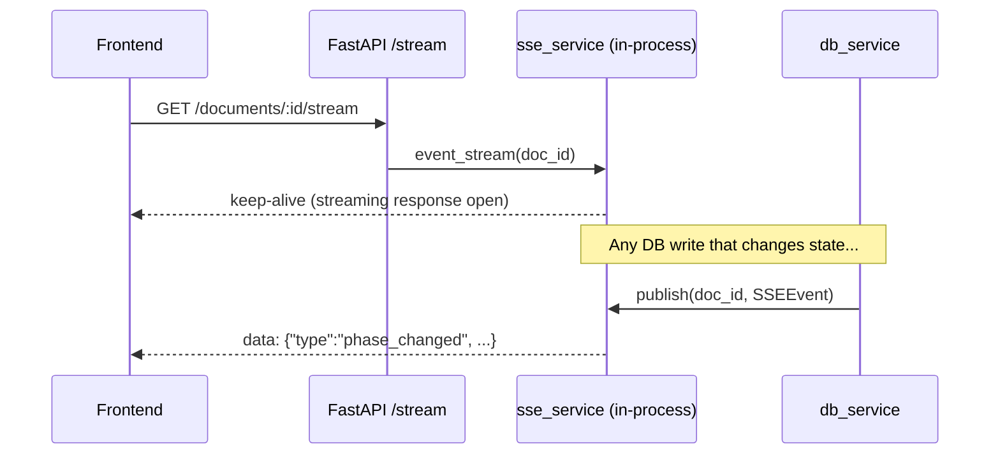
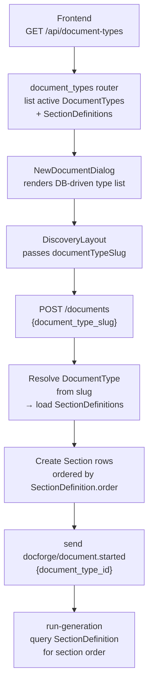

# DocForge Architecture

This document describes the current system architecture as of Milestone 3.

---

## 1. System Overview

DocForge is a monorepo (`packages/backend` + `packages/frontend`) with four runtime services coordinated via Docker Compose.



---

## 2. Frontend Layer



**Key frontend rules:**
- `DocumentPage.tsx` is the single entry point; it reads `location.state.documentTypeSlug` from the router and passes it down to `DiscoveryLayout`.
- `useDocument` is the single source of truth for document state — polling every 2 seconds.
- SSE (`/stream`) pushes real-time events (`phase_changed`, `section_updated`, `error`) to speed up UI reactions without waiting for the poll cycle.
- All API responses are `snake_case`; explicit mapper functions in `api.ts` convert to `camelCase` for TypeScript types.
- Tailwind CSS v4 with custom design tokens (`on-surface`, `primary`, etc.) defined in `src/index.css`.

---

## 3. Backend API Layer



**Routers:**

| Router | Prefix | Protected | Responsibility |
|---|---|---|---|
| `documents` | `/api/documents` | Yes | CRUD + event dispatch + SSE stream |
| `sections` | `/api/sections` | Yes | Section content, versions, chat |
| `document_types` | `/api/document-types` | No | List active types + section definitions |
| `users` | `/api/users` | Yes | Profile, credits |

**Authentication (`app/auth.py`):**
- Fetches Clerk JWKS and caches for 1 hour.
- Validates RS256 tokens + `azp` (authorized party) claim.
- Auto-creates a `User` row on first login (upsert).
- All protected routes return 404 (not 403) on ownership mismatch — intentional.

---

## 4. Inngest Workflow Engine

Inngest implements the 6-phase document lifecycle as durable, retriable event-driven functions. All workflow state survives restarts; PostgreSQL is the source of truth for document data.

### 4.1 Event Flow



### 4.2 Inngest Functions

| Function ID | Trigger Event | Concurrency Key | Role |
|---|---|---|---|
| `run-discovery` | `docforge/document.started` | `document_id` | Phase 1 loop |
| `run-alignment` | `docforge/discovery.completed` | `document_id` | Phase 2 loop |
| `run-generation` | `docforge/alignment.completed` | `document_id` | Phase 3 sequential sections |
| `start-refinement` | `docforge/generation.completed` | `document_id` | Phase 4 setup |
| `handle-section-action` | `docforge/user.section_action` | `section_id` | Phase 4 per-action (stateless) |
| `run-audit` | `docforge/document.refinement_completed` | `document_id` | Phase 5 |
| `complete-document` | `docforge/document.audit_completed` | `document_id` | Phase 6 |
| `weekly-credit-reset` | Cron | — | Weekly user credit reset |

**Concurrency design:**
- `DOC_CONCURRENCY`: limits 1 active workflow per document — prevents two phases running simultaneously.
- `SECTION_CONCURRENCY`: limits 1 active AI call per section — `handle-section-action` acquires the lock on entry and releases on return. No `wait_for_event` inside, so the lock is never held across user think-time.

---

## 5. AI Layer

Each phase has a dedicated `ai.py` module inside `app/phases/<phase>/`. All modules go through a shared pipeline: input guardrails → context building (with truncation) → `call_with_retry` → token usage logging. Shared infrastructure lives in `app/ai/core/`.

### 5.1 AI Call Pipeline



### 5.2 Phase AI Modules

| Module | Output Type | Key Features |
|---|---|---|
| `phases/discovery/ai.py` | `{is_sufficient, follow_up_questions, consolidated_context}` | JSON schema output, iterates until sufficient |
| `phases/alignment/ai.py` | `{summaries: {context, proposal, implementation, risks}}` | JSON schema, per-section directives |
| `phases/alignment/contract.py` | `{entities, decisions, terminology, constraints}` | Runs after alignment approval; stored in DB |
| `phases/generation/ai.py` | `str` (Markdown) | Mermaid diagrams required in proposal+implementation; coherence pass |
| `phases/refinement/ai.py` | `{tool, ...args}` | Tool calling (`request_edit` / `answer_question`); section-specific directives |
| `phases/audit/ai.py` | `{has_problems, problems[]}` | Cross-section consistency; uses contract for grounding |

### 5.3 Prompt Strategy



The DB contains RFC-specific prompt templates (seeded by migration `009`). `prompts/documents.yaml` provides document-type-agnostic defaults and is the canonical fallback — there are no hardcoded Python string constants. A missing prompt key raises `ConfigurationError` immediately rather than silently using an empty string.

---

## 6. Data Layer

### 6.1 Key Models

```mermaid
erDiagram
    User {
        uuid id PK
        string clerk_id UK
        string email
        int credits
    }
    Document {
        uuid id PK
        uuid user_id FK
        uuid document_type_id FK
        string title
        string current_phase
        text document_context
        text global_context
        text user_preferences
        text error_message
    }
    DocumentType {
        uuid id PK
        string slug UK
        string name
        bool is_active
    }
    SectionDefinition {
        uuid id PK
        uuid document_type_id FK
        string section_key
        int order
        string display_name
    }
    PromptTemplate {
        uuid id PK
        uuid document_type_id FK
        string phase
        string section_key
        text prompt_text
    }
    DocumentContract {
        uuid id PK
        uuid document_id FK UK
        json entities
        json decisions
        json terminology
        json constraints
        text raw_contract
    }
    Section {
        uuid id PK
        uuid document_id FK
        string section_type
        string status
        text summary
    }
    SectionVersion {
        uuid id PK
        uuid section_id FK
        uuid parent_version_id FK
        string version_name
        text content
        bool is_active
    }
    ChatMessage {
        uuid id PK
        uuid document_id FK
        uuid section_id FK
        string role
        text content
    }
    DiscoveryQuestion {
        uuid id PK
        uuid document_id FK
        text question
        text answer
        bool skipped
    }
    AuditFinding {
        uuid id PK
        uuid document_id FK
        string section_type
        text description
        string severity
        bool dismissed
    }

    User ||--o{ Document : owns
    Document }o--|| DocumentType : "type"
    DocumentType ||--o{ SectionDefinition : defines
    DocumentType ||--o{ PromptTemplate : has
    Document ||--o| DocumentContract : has
    Document ||--o{ Section : contains
    Section ||--o{ SectionVersion : versions
    Section ||--o{ ChatMessage : chat
    Document ||--o{ ChatMessage : chat
    Document ||--o{ DiscoveryQuestion : questions
    Document ||--o{ AuditFinding : findings
```

### 6.2 Database Access Pattern

All DB access goes through `AsyncSession` (SQLAlchemy async). The `services/db.py` module is the only place that writes to the DB — routers and workflow helpers always call through it.

**Section versioning:** `SectionVersion` records form a tree via `parent_version_id`. Only one version per section has `is_active = true` (enforced by a unique partial index). `create_section_version()` deactivates the previous active version and inserts the new one atomically.

**SSE integration:** Every `db.py` write that changes observable state publishes an SSE event via `sse_service.publish()`. The frontend SSE stream (`/api/documents/:id/stream`) delivers these events in real time.

---

## 7. SSE (Server-Sent Events)



SSE events are published in-process (no message broker). The `event_stream()` generator yields events as they arrive. The frontend also polls every 2 seconds as a fallback.

---

## 8. Multi-Document Type System



The document type drives: which sections exist, in what order, and which AI prompt templates are used. The RFC document type is seeded by migrations `006` and `009`.

---

## 9. Credit System

- Each `User` starts with N credits (seeded on first login).
- `POST /documents` atomically decrements credits (`UPDATE ... WHERE credits >= 1`). Returns 402 if zero.
- A weekly Inngest cron (`weekly-credit-reset`) resets all users' credits.
