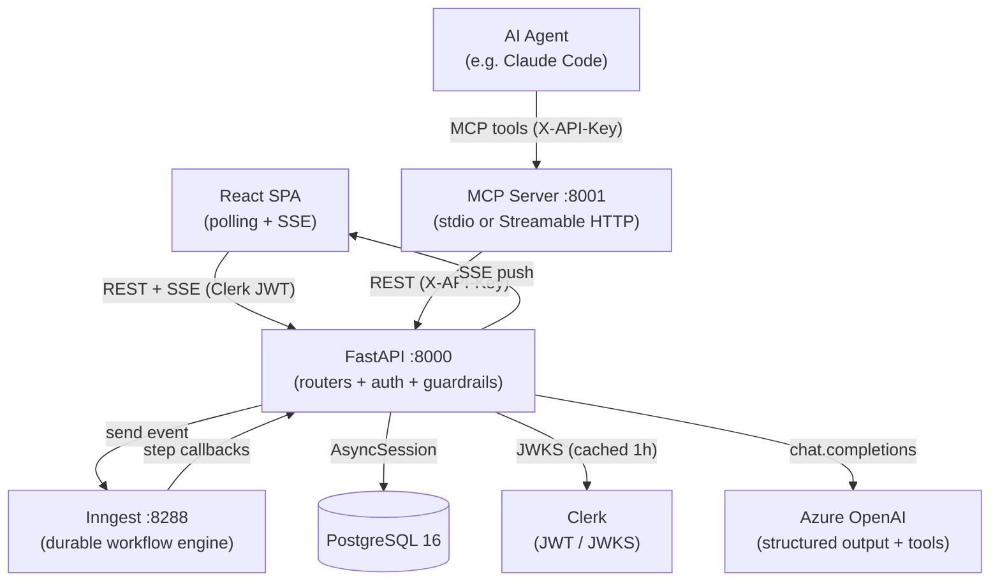

# DocForge — AI-Powered Technical Document Generator


DocForge supports two document creation modes. The **AI-guided** mode drives users through a structured six-phase workflow (discovery → alignment → generation → refinement → audit → completed) that produces documents which are internally consistent and grounded in the user's actual intent. The **free editor** mode gives users a full-featured Markdown editor with version history and heading-based navigation — no AI workflow required.

A built-in **MCP server** lets AI agents (e.g. Claude Code) read and write to DocForge editor documents in real-time — the agent reads local files using its own tools, writes structured content into a shared document, and the user watches it fill in live via SSE.

**[Live Demo](https://doc-forge.dev)**

<div align="center">
  <video src="https://github.com/user-attachments/assets/b79e2a6e-23b5-4914-a186-aa8490da3090" autoplay loop muted playsinline width="100%"></video>
</div>

> **Experimental / MVP** — This project is a work-in-progress and may be modified, suspended, or discontinued at any time without prior notice.

> **AI Disclaimer** — Content generated by this application is produced by AI models and may contain errors or inaccuracies. Always review output before using it in any professional or technical context.

> **Privacy** — DocForge uses [Clerk](https://clerk.com) for authentication, stores documents in a PostgreSQL database, and sends prompts to Azure OpenAI for content generation. See the [Privacy Policy](legal/privacy.md) for details.

---

## How It Works

### AI-Guided Mode (3 credits)

Documents flow through six sequential phases, each with defined inputs, outputs, and user checkpoints:

| Phase | What happens |
|---|---|
| **1. Discovery** | AI asks up to 2 targeted follow-up questions **per section** until context is sufficient for that section. Each section is handled independently; questions are scoped to that section's purpose before moving to the next. |
| **2. Alignment** | AI generates 1–3 sentence summaries per section. User approves or rejects. On approval, a structured **Document Contract** is extracted. |
| **3. Generation** | Sections are generated sequentially so each one can reference those already written. A coherence pass then checks cross-section consistency. |
| **4. Refinement** | Per-section interactive editing: request AI edits, ask questions, or submit manual changes for AI review. Finalize when satisfied. |
| **5. Audit** | AI audits all sections for contradictions, terminology drift, and scope violations. Failing sections reopen for revision. |
| **6. Completed** | Final document is assembled and ready to export. |

### Free Editor Mode (1 credit)

A single-pane Markdown editor for writing without AI assistance. Features a heading-derived navigation tree (h1–h5), source/preview toggle, auto-save with 1.5 s debounce, manual version snapshots, inline version diff viewer, and Markdown export.

### MCP Agent Mode

An external AI agent creates an editor document via the MCP server, writes content section by section, and the user watches it appear in real-time in the browser. Every write and snapshot is attributed in the Activity panel. The agent and user share the same live document — no copy-pasting required.

```
Claude Code → docforge MCP server → DocForge REST API → SSE → browser
```

See [packages/mcp/README.md](packages/mcp/README.md) for setup and [packages/mcp/TOOLS.md](packages/mcp/TOOLS.md) for the full tool reference.

---

## Features

- **Two creation modes** — AI-guided (structured 6-phase workflow, 3 credits) or free editor (immediate Markdown editing, 1 credit). Switchable from the New Document dialog.
- **Context-aware discovery** — AI asks follow-up questions scoped to each individual section and synthesizes per-section context before alignment begins, grounding each section summary in directly relevant information.
- **Alignment checkpoint** — Section summaries are shown for approval before any full content is generated, preventing wasted generation cycles.
- **Document Contract** — After alignment, a structured contract (entities, decisions, terminology, constraints) is extracted and injected into every downstream AI call to enforce consistency across all sections.
- **Sequential generation with cross-section context** — Each section is generated with access to the content of previously generated sections, so the document builds coherently rather than in isolation.
- **Interactive refinement** — Per-section AI editing loop with full version history and one-click rollback.
- **Automated audit** — Cross-section consistency check that catches terminology drift, technology contradictions, and scope violations.
- **Free editor with version history** — Full Markdown editor with heading-derived navigation (h1–h5), auto-save, manual snapshots, inline diff viewer, and Markdown export.
- **MCP server** — AI agents connect via the Model Context Protocol to create and write editor documents in real-time. Supports both stdio (local) and Streamable HTTP (hosted) transports. Every agent action is attributed by API key name in the Activity panel.
- **API key management** — Users generate named API keys (one per agent/environment) from the DocForge UI. Keys appear in the activity log and version history, making multi-agent usage fully traceable.
- **Input & output guardrails** — User inputs are validated before any AI call; malformed AI responses are retried automatically.
- **Token-aware context management** — Char-based token estimation with per-phase budgets truncates context intelligently to avoid exceeding model limits.
- **Multi-document type support** — Document types, section definitions, and AI prompt templates are database-driven, making it straightforward to add new document types beyond RFC.
- **Real-time updates** — Server-sent events push phase transitions and section updates to the frontend instantly, alongside 2-second polling as a fallback.
- **Durable workflow orchestration** — The entire AI-guided workflow runs as retriable Inngest functions. No state is lost on restart or failure.
- **Configurable credit system** — Weekly credit allocation and per-mode costs are set via environment variables (`WEEKLY_CREDITS`, `GUIDED_DOCUMENT_COST`, `EDITOR_DOCUMENT_COST`).

---

## Tech Stack

| Layer | Technology |
|---|---|
| Frontend | React 19, TypeScript, Vite, Tailwind CSS v4, Zustand, React Router 7 |
| Backend | FastAPI 0.115, SQLAlchemy 2 (async), Alembic, Pydantic v2 |
| MCP Server | Python, `mcp` SDK, httpx, uvicorn — stdio + Streamable HTTP transports |
| Orchestration | Inngest (event-driven durable workflows) |
| AI | Azure OpenAI (gpt-4o-mini), structured JSON output + tool calling |
| Auth | Clerk (RS256 JWT, JWKS validation) + API key (SHA-256, `X-API-Key` header) |
| Infra | PostgreSQL 16, Docker Compose |

---

## Architecture

The system has four runtime services: a React SPA, a FastAPI backend, an Inngest workflow server, and PostgreSQL. The backend is the only service that touches the database and the AI provider. Inngest communicates with the backend via HTTP callbacks, enabling durable, retriable multi-step workflows.



For the full architecture with sequence diagrams, ER diagram, and detailed layer descriptions, see [ARCHITECTURE.md](ARCHITECTURE.md).

---

## Local Development

### Prerequisites

- Node.js 20+
- Python 3.11+
- Docker (for PostgreSQL and Inngest dev server)

### Setup

**1. Install root dependencies**

```bash
npm install
```

**2. Start infrastructure** (PostgreSQL + Inngest dev server)

```bash
npm run infra:up
```

**3. Set up the backend**

```bash
cd packages/backend
python -m venv .venv

# Windows
.venv\Scripts\activate
# macOS / Linux
source .venv/bin/activate

pip install -e ".[dev]"
cp .env.example .env   # fill in your API keys
```

**4. Run database migrations**

```bash
npm run db:migrate
```

**5. Start development servers**

```bash
# Terminal 1
npm run dev:frontend

# Terminal 2
npm run dev:backend
```

Frontend: `http://localhost:5173` — Backend: `http://localhost:8000`

**6. (Optional) Run the MCP server locally**

```bash
cd packages/mcp
pip install -e .
export DOCFORGE_API_KEY="your-key"          # generate one in the DocForge UI
export DOCFORGE_API_BASE="http://localhost:8000/api"
docforge-mcp                                # stdio — add to Claude Code config
# or
docforge-mcp-server                         # HTTP on :8001
```

See [packages/mcp/README.md](packages/mcp/README.md) for Claude Code integration details.

### Environment Variables

| File / Scope | Variables |
|---|---|
| `packages/backend/.env` | `DATABASE_URL`, `AZURE_OPENAI_ENDPOINT`, `AZURE_OPENAI_API_KEY`, `AZURE_OPENAI_DEPLOYMENT`, `INNGEST_EVENT_KEY`, `INNGEST_SIGNING_KEY`, `CLERK_JWKS_URL`, `WEEKLY_CREDITS` (default `5`), `GUIDED_DOCUMENT_COST` (default `3`), `EDITOR_DOCUMENT_COST` (default `1`) |
| `packages/frontend/.env` | `VITE_API_BASE`, `VITE_CLERK_PUBLISHABLE_KEY` |
| MCP server (env) | `DOCFORGE_API_KEY` (stdio mode), `DOCFORGE_API_BASE` (default `http://localhost:8000/api`), `DOCFORGE_FRONTEND_BASE` (default `http://localhost:5173`), `HOST`, `PORT` (HTTP mode, default `8001`) |

See [`packages/backend/.env.example`](packages/backend/.env.example) and [`packages/frontend/.env.example`](packages/frontend/.env.example) for full reference.

---

## License

MIT — see [LICENSE](LICENSE) for details.

## Legal

- [Terms of Use](legal/terms.md)
- [Privacy Policy](legal/privacy.md)

## Contact

maxjneto@gmail.com
