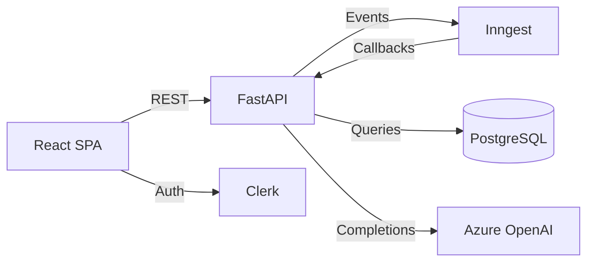

# DocForge - AI Powered Document Generator


Automate the full lifecycle of technical document creation through a structured, AI-driven multi-phase workflow.

 **[Live Demo](PENDING_URL)**
 
<div align="center">
  <video src="https://github.com/user-attachments/assets/b79e2a6e-23b5-4914-a186-aa8490da3090" autoplay loop muted playsinline width="100%"></video>
</div>

> **Experimental / MVP** — This project is a work-in-progress. It may be modified, suspended, or discontinued at any time without prior notice.

> **AI Disclaimer** — Content generated by this application is produced by AI models and may contain errors, inaccuracies, or omissions. Always review and validate output before using it in any professional or technical context.

> **Privacy** — DocForge uses [Clerk](https://clerk.com) for authentication, stores documents in a PostgreSQL database, and sends prompts to Azure OpenAI for content generation. See the [Privacy Policy](legal/privacy.md) for details.

---

## Features

- **Intelligent Discovery** — AI iteratively asks follow-up questions until it has enough context to proceed, adapting to each document's unique requirements.
- **Alignment Phase** — Generates and presents section-level summaries for user approval before any full content is written.
- **Parallel Generation** — Sections are generated concurrently (proposal, implementation, risks, context), then refined in a cross-section coherence pass.
- **Interactive Refinement** — Per-section editing loop: request AI edits, analyse your own manual changes, ask questions, or finalise when satisfied.
- **Automated Audit** — After all sections are finalised, an audit validates document quality and reopens any failing sections for revision.
- **Event-Driven Orchestration** — The entire workflow runs as durable, retriable Inngest functions, so no lost state!

---

## Tech Stack

| Layer | Technology |
|---|---|
| Frontend | React 19, TypeScript, Tailwind CSS v4, Zustand, React Router 7 |
| Backend | FastAPI 0.115, SQLAlchemy 2 (async), Alembic, Pydantic v2 |
| Orchestration | Inngest (event-driven multi-step workflows) |
| AI | Azure OpenAI (gpt-4o-mini) |
| Auth | Clerk |
| Infra | PostgreSQL 16, Docker Compose |

---

## Architecture



---

## Local Development

### Prerequisites

- Node.js 20+
- Python 3.11+
- Docker (for PostgreSQL and Inngest dev server)

### Setup

**1. Install root dependencies**

```bash
npm install
```

**2. Start infrastructure** (PostgreSQL + Inngest dev server)

```bash
npm run infra:up
```

**3. Set up the backend**

```bash
cd packages/backend
python -m venv .venv

# Windows
.venv\Scripts\activate
# macOS / Linux
source .venv/bin/activate

pip install -e ".[dev]"
cp .env.example .env   # fill in your API keys
```

**4. Run database migrations**

```bash
npm run db:migrate
```

**5. Start development servers** (two separate terminals)

```bash
# Terminal 1
npm run dev:frontend

# Terminal 2
npm run dev:backend
```

The frontend is available at `http://localhost:5173` and the backend at `http://localhost:8000`.

### Environment Variables

Copy the example files and fill in the required values:

| File | Variables |
|---|---|
| `packages/backend/.env` | `DATABASE_URL`, `AZURE_OPENAI_ENDPOINT`, `AZURE_OPENAI_API_KEY`, `AZURE_OPENAI_DEPLOYMENT`, `INNGEST_EVENT_KEY`, `INNGEST_SIGNING_KEY`, `CLERK_JWKS_URL` |
| `packages/frontend/.env` | `VITE_API_BASE`, `VITE_CLERK_PUBLISHABLE_KEY` |

See [`packages/backend/.env.example`](packages/backend/.env.example) and [`.env.example`](.env.example) for full reference.

---

## License

MIT — see [LICENSE](LICENSE) for details.

## Legal

- [Terms of Use](legal/terms.md)
- [Privacy Policy](legal/privacy.md)

## Contact

maxjneto@gmail.com
